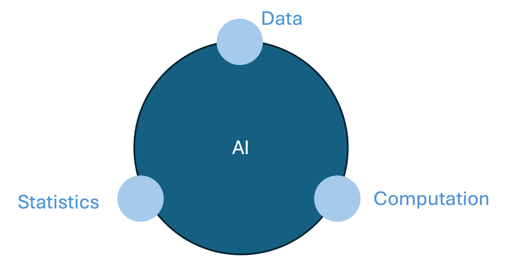
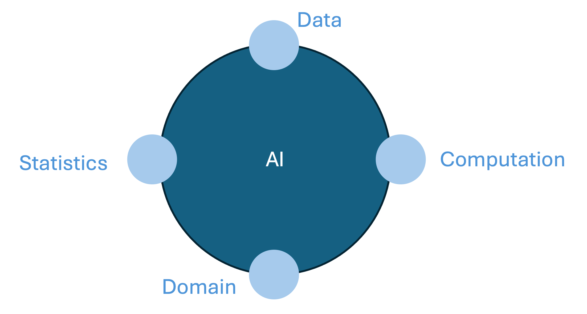

# Domain Defined Deep Learning

## Context

AI is a prediction machine. The key idea behind AI has been that it is 100% based on learning patterns from data using statistics and powerful computers. While this is extremely powerful, it is requiring large amounts of data and computational power.

Moreover, there are application of AI, where we may have more information than just the observational data. In these cases, if we could capture that information in the AI model, it would likely be more accurate and require less data and computational power.

The idea behind domain driven AI is to include additional domain knowledge into the AI models. This is particularly powerful when the domain can be described using quantitative methods, such as mathematical sciences.

In general, they domain knowledge can be used to define the architecture (i.e functional form) of the AI models and/or the training methodology of the AI model. We will show examples of both applications and of course, they can be combined as well. The hope is that with this additional information the reliance on data and computation can be reduced and thus pave the way for much more scalable and efficient AI models.

When we do traditional AI modelling, we try to build a model for the observed data without having any prior knowledge about what the model could be. This has two potential issues:

1. It is computational much more intensive as we have guess different equations of the model and then fit the parameters of the equation through gradient descent.
2. Usually it is very hard to interpret the equation fitted to the data and thus difficult to understand any causal effects

If we have additional understanding of the equations governing the observed data, adding in that information into the AI process should mean the models are easier to train and will increase the confidence in the final models. This is the main idea being combining AI and domain knowledge.

This concept has been best developed in physics where the domain information is usually defined using differential equations describing physical phenomena. The idea of combining AI with physics is made concrete by include the differential equations as constraints into the loss function used to train AI models. This approach has become widely known under the phrase Physics informed Neural Networks (PiNNs).

While this method was invented in the context of physics, it is completely general and can be applied to any domain, hence in general we would like to introduce the concept of Domain Defined Deep Learning (D3L), in which information of an underlying system is embodied into the loss function (through differential equations or otherwise).

## How to use this repo

The notebooks folder contains walkthrough notebooks of specific examples. 
If new notebooks are to be added with new examples, please make sure they include the mathematical descriptions where appropriate, as well as the code.
Then, if possible, please include a non-notebook python version that can be used for batch training etc. (eventually on Azure)